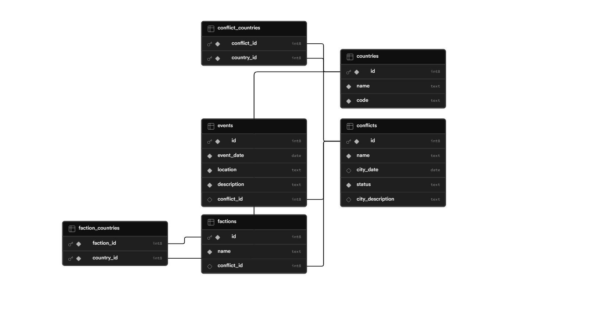

# Conflict Tracker — Desplegament Fullstack

## 🔗 URLs Públiques

- **Frontend (Vercel):** https://conflict-tracker-vue-nine.vercel.app/
- **Backend (Railway):** https://conflicttrackerapi-production.up.railway.app/

---

## 🏗️ Arquitectura

```
Usuari
  │
  ▼
Frontend (Vercel)          Vue 3 + Vite
  │  REST/HTTPS
  ▼
Backend (Railway)          Spring Boot
  │  JDBC/SSL
  ▼
Base de Dades (Supabase)   PostgreSQL
```

---

##  📊 Esquema Supabase



---

## ⚙️ Variables d'Entorn

### Backend — Railway

| Variable | Descripció |
|----------|-----------|
| `DB_URL` | `jdbc:postgresql://aws-1-eu-central-1.pooler.supabase.com:6543/postgres?sslmode=require` |
| `DB_USER` | `postgres.wwuwlxspdepdfeahcqpq` |
| `DB_PASSWORD` | `supabaseJoel1234` |

```yaml
# application.yml
spring:
  datasource:
    url: ${DB_URL}
    username: ${DB_USER}
    password: ${DB_PASSWORD}
```

### Frontend — Vercel

| Variable | Descripció |
|----------|-----------|
| `VITE_API_BASE_URL` | https://conflicttrackerapi-production.up.railway.app |

---

## 🔧 Modificacions Realitzades

### Backend — Spring Boot

#### 1. Connexió a la base de dades amb variables d'entorn

**Error inicial:**
```
Connection refused: connect to address localhost:5432
HikariPool-1 - Connection is not available, request timed out after 30000ms.
```

**Solució:** Substituir les credencials hardcoded del `application.yml` per variables d'entorn `${}` i configurar-les al panell de Railway.

---

#### 2. Configuració de CORS

**Error inicial** (consola del navegador):
```
Access to XMLHttpRequest at 'https://conflicttrackerapi-production.up.railway.app/...'
from origin 'https://conflict-tracker-vue-nine.vercel.app' has been blocked by CORS policy.
```

**Solució:** Especificar el domini exacte de Vercel a la configuració CORS:

```java
@Configuration
public class CorsConfig implements WebMvcConfigurer {
    @Override
    public void addCorsMappings(CorsRegistry registry) {
        registry.addMapping("/**")
            .allowedOrigins("https://conflict-tracker-vue-nine.vercel.app")
            .allowedMethods("GET", "POST", "PUT", "DELETE", "OPTIONS")
            .allowedHeaders("*");
    }
}
```

---

### Frontend — Vue 3

#### 3. Errors 404 en refresc de pàgina (SPA Routing)

**Error inicial:** En refresc o accés directe a una ruta (p. ex. `/conflicts/5`), Vercel retornava un `404: NOT_FOUND`.

**Solució:** Crear `vercel.json` a l'arrel del projecte:

```json
{
  "rewrites": [
    { "source": "/(.*)", "destination": "/index.html" }
  ]
}
```

